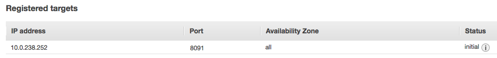

# How-to automate AWS ELB to expose APIs

This is a set of sample to automate the binding of Mule APIs with AWS ELB.
1. A AWS System API which will configure AWS Target Group
2. An example of an API using AWS ELB (source here: https://github.com/anthonyrabiaza/aws-elb-dummy-api)

## Getting Started

Please pull the sources of the two Mule Project from github.

You have to configure and deploy *aws-elb-system-api* and update your API following the example *aws-elb-dummy-api*.

### Prerequisites

Yon need to have the following elements:
- A AWS Elastic Load Balancer (Application Load Balancer)
- A Target Group

AWS Application ELB:


AWS Target Group:


THe AWS Target Group can have an existing configuration or not:


For any change in the project, you would need to setup Maven and a have a Maven account from MuleSoft. See https://github.com/anthonyrabiaza/cicd-dummy

### Deploying the System API *aws-elb-system-api*
This Mule Application is responsible of registering and deregistering the APIs using AWS ELB.
You can deploy multiple versions of this Application if required.

Before deploying the AWS, please update the mule-app.properties file:

```
aws.elb.region=ap-southeast-1
aws.elb.targetgroup.arn=arn:aws:elasticloadbalancing:ap-southeast-1:492498145701:targetgroup/elb-tg/33ad2a22f37ff3cb
aws.elb.targetgroup.port=8091

aws_access_key_id=<<ID from Security Credentials Access keys>>
aws_secret_access_key=<<Secret from Security Credentials>>
```

The first two parameters are related to the AWS ELB components: the AWS Region and the ARN of the AWS ELB (previous screen).

The third parameter is the port exposed by the API (in your example 8091): 
- 8091 if the API is exposing service via HTTP from VPC
- 8092 if the API is exposing service via HTTPS from VPC


Once deployed, please note the endpoint of the Application, it can be:
- http://cloudhub_application_name for a CloudHub deployment, for instance: http://aws-elb-system-api.au.cloudhub.io
or
- http://server:port for Hybrid deployment, for instance: http://edge:8091

### Implementing the OnStartupOnShutdown ELB Event in your API

Copy the following elements from the example *aws-elb-dummy-api* to your API Project:

- The flow aws-elb-OnStartupOnShutdown.xml


- The Java classes


Once the copy made, you have add the following property to mule-app.properties:
- For a Cloudhub deployment (in Singapore), you would need to add **mule-worker-internal-** to the previous noted endpoint:
```
aws-elb-system-api.url=http://mule-worker-internal-aws-elb-system-api-ant.au.cloudhub.io:8091/api/event
```
- For an Hybrid deployment:
```
aws-elb-system-api.url=http://edge:8091/api/event
```

### Checking the events

Once the AWS System API is configured and deployed. You can deploy an API and check the logs of both of the applications.

#### Start of API
- API logs

```
INFO  com.mulesoft.mule.tools.startup.OnStartupOnShutdown - ## IS READY ACTIVITIES
INFO  com.mulesoft.mule.tools.startup.ELBEvent - Calling AWS ELB System API (http://mule-worker-internal-aws-elb-system-api-ant.au.cloudhub.io:8091/api/event?apiName=aws-elb-dummy-api&ipAddress=10.0.238.252,127.0.0.1&state=start)
INFO  com.mulesoft.mule.tools.startup.ELBEvent - Response code:200
INFO  com.mulesoft.mule.tools.startup.OnStartupOnShutdown - ## END OF IS READY ACTIVITIES
```

- AWS System API logs:

```
INFO  org.mule.api.processor.LoggerMessageProcessor - 
org.mule.DefaultMuleMessage
{
  id=64c91b30-ca82-11e7-8083-000c296d8c98
  payload=org.mule.transport.NullPayload
  correlationId=<not set>
  correlationGroup=-1
  correlationSeq=-1
  encoding=UTF-8
  exceptionPayload=<not set>

Message properties:
  INVOCATION scoped properties:
    _ApikitResponseTransformer_AcceptedHeaders=text/html, image/gif, image/jpeg, *; q=.2, */*; q=.2
    _ApikitResponseTransformer_apikitRouterRequest=yes
    _ApikitResponseTransformer_contractMimeTypes=[]
  INBOUND scoped properties:
    accept=text/html, image/gif, image/jpeg, *; q=.2, */*; q=.2
    connection=keep-alive
    content-length=0
    content-type=application/x-www-form-urlencoded
    host=mule-worker-internal-aws-elb-system-api-ant.au.cloudhub.io:8091
    http.listener.path=/api/*
    http.method=POST
    http.query.params=ParameterMap{[apiName=[aws-elb-dummy-api], ipAddress=[10.0.238.252,127.0.0.1], state=[start]]}
    http.query.string=apiName=aws-elb-dummy-api&ipAddress=10.0.238.252,127.0.0.1&state=start
    http.relative.path=/api/event
    http.remote.address=/10.0.238.252:39995
    http.request.path=/api/event
    http.request.uri=/api/event?apiName=aws-elb-dummy-api&ipAddress=10.0.238.252,127.0.0.1&state=start
    http.scheme=http
    http.uri.params=ParameterMap{[]}
    http.version=HTTP/1.1
    user-agent=Java/1.8.0_121
  OUTBOUND scoped properties:
  SESSION scoped properties:
}
```
If the Application is not deployed in a VPC with an IP starting with *10.* the first IP will be used and the following message will be displayed:
```
ERROR com.mulesoft.mule.tools.aws.elb.ConfigureELBTargetGroup - No valid ip found in list (192.168.0.168,127.0.0.1), using first one
```

You can see the update of the configuration in AWS Target Group:


#### Stop of API

- API logs
```
INFO  com.mulesoft.mule.tools.startup.OnStartupOnShutdown - ## SHUTDOWN ACTIVITIES
INFO  com.mulesoft.mule.tools.startup.ELBEvent - Calling AWS ELB System API (http://mule-worker-internal-aws-elb-system-api-ant.au.cloudhub.io:8091/api/event?apiName=aws-elb-dummy-api&ipAddress=10.0.238.252,127.0.0.1&state=stop)
INFO  com.mulesoft.mule.tools.startup.ELBEvent - Response code:200
INFO  com.mulesoft.mule.tools.startup.OnStartupOnShutdown - ## END OF SHUTDOWN ACTIVITIES
```

- AWS System API logs:

```
INFO  org.mule.api.processor.LoggerMessageProcessor - 
org.mule.DefaultMuleMessage
{
  id=cdcd7f20-ca84-11e7-8083-000c296d8c98
  payload=org.mule.transport.NullPayload
  correlationId=<not set>
  correlationGroup=-1
  correlationSeq=-1
  encoding=UTF-8
  exceptionPayload=<not set>

Message properties:
  INVOCATION scoped properties:
    _ApikitResponseTransformer_AcceptedHeaders=text/html, image/gif, image/jpeg, *; q=.2, */*; q=.2
    _ApikitResponseTransformer_apikitRouterRequest=yes
    _ApikitResponseTransformer_contractMimeTypes=[]
  INBOUND scoped properties:
    accept=text/html, image/gif, image/jpeg, *; q=.2, */*; q=.2
    connection=keep-alive
    content-length=0
    content-type=application/x-www-form-urlencoded
    host=mule-worker-internal-aws-elb-system-api-ant.au.cloudhub.io:8091
    http.listener.path=/api/*
    http.method=POST
    http.query.params=ParameterMap{[apiName=[aws-elb-dummy-api], ipAddress=[10.0.238.252,127.0.0.1], state=[stop]]}
    http.query.string=apiName=aws-elb-dummy-api&ipAddress=10.0.238.252,127.0.0.1&state=stop
    http.relative.path=/api/event
    http.remote.address=/10.0.238.252:40204
    http.request.path=/api/event
    http.request.uri=/api/event?apiName=aws-elb-dummy-api&ipAddress=10.0.238.252,127.0.0.1&state=stop
    http.scheme=http
    http.uri.params=ParameterMap{[]}
    http.version=HTTP/1.1
    user-agent=Java/1.8.0_121
  OUTBOUND scoped properties:
  SESSION scoped properties:
}
```

You can see the update of the configuration in AWS Target Group:


If the Application is not deployed in a VPC with an IP starting with *10.* the first IP will be used and the following message will be displayed:
```
ERROR com.mulesoft.mule.tools.aws.elb.ConfigureELBTargetGroup - No valid ip found in list (192.168.0.168,127.0.0.1), using first one
```
